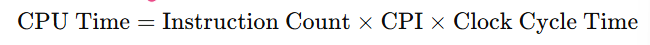

# CPU Performance Basics

## Concepts

**Performance Equation**

- **Instruction Count**: depends on program, compiler, ISA
- **CPI (Cycles per Instruction)**: efficiency of pipeline & architecture
- **Clock Cycle Time**: inverse of CPU frequency

**Throughput vs Latency**

- *Latency*: time to finish one task
- *Throughput*: number of tasks per unit time

**IPC (Instructions Per Cycle)**

- IPC = 1 / CPI (in ideal single-issue pipeline)
- Higher IPC = more parallelism

**Amdahl’s Law**

- Speedup is limited by the non-improved portion:

- *f* = fraction improved, *k* = speedup factor

## Q&A

### What is the formula for CPU execution time?

The CPU execution time is:

or

### Why might a higher clock frequency not always give better performance?

Because performance also depends on instruction count and CPI. Increasing frequency shortens cycle time, but it can increase CPI due to longer pipelines, cache misses, or branch penalties. Memory bottlenecks and I/O latency can also limit the gains.

### Explain Amdahl’s Law and give a practical example.

Amdahl’s Law says the speedup from an improvement is limited by the fraction of execution time that cannot be improved

If 40% of a program is serial and cannot be parallelized, even with infinite cores, the maximum speedup is 1/0.4=2.5. This shows that focusing only on parallelism won’t give unlimited speedup.

### Difference between latency and throughput?

Latency: the time it takes to complete one task.

Throughput: the number of tasks completed per unit of time.

Example: A CPU with pipelining improves throughput (more instructions per cycle) but does not reduce the latency of a single instruction.

### What does IPC mean, and why is it important?