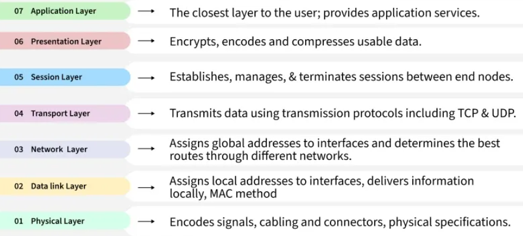
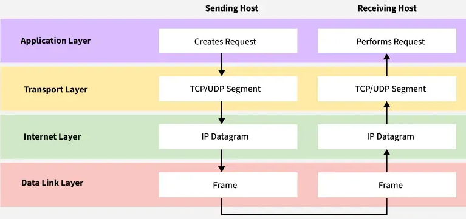
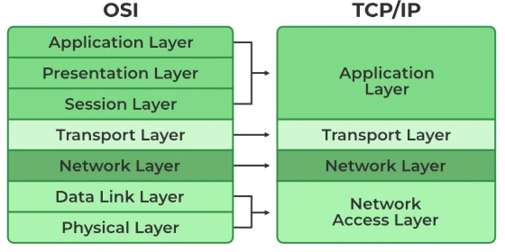
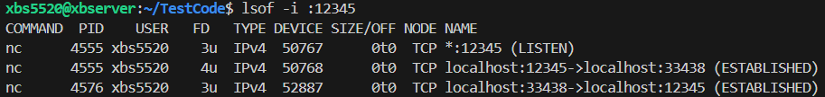
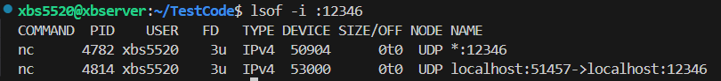
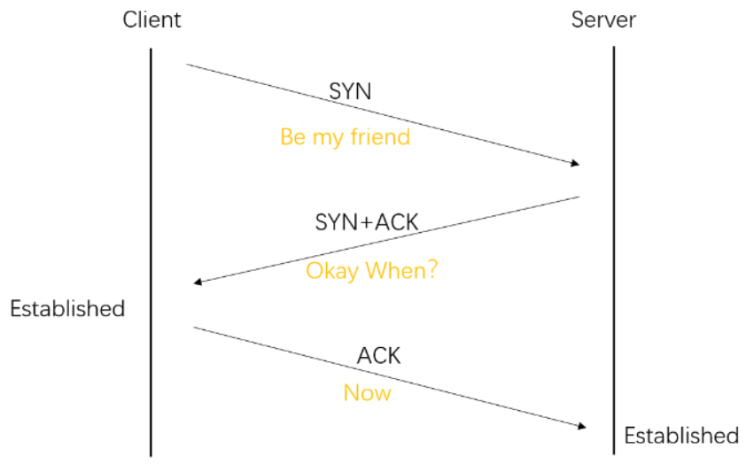
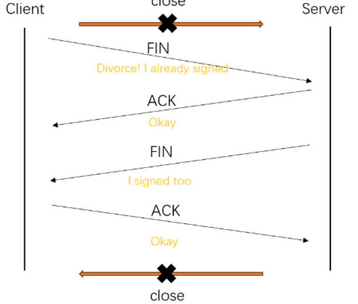

# TCP/IP

## Concept

### OSI vs TCP/IP model

OSI: 7 layers (Physical → Application)



TCP/IP: 4 layers (Link, Internet, Transport, Application)





### **IP**

Best-effort delivery, no guarantee of order/reliability.

```shell
#check networks interfaces and IPs
ip addr
#or
ifconfig
```

### **TCP**

Reliable, connection-oriented, ordered.

```shell
#TCP connections
netstat -tulnp | head
#or ss(Socket Statistics)
ss -tulnp | head
```

### **UDP**

Unreliable, connectionless, fast.

```shell
#use TCP and UDP set a connection
#TCP
nc -l 12345
#other terminal
nc 127.0.0.1 12345
```

use `lsof ` to check port. They are established.



```shell
#UDP
nc -u -l 12346
#other terminal
nc -u 127.0.0.1 12346
```

not established.



### **Ports**

Identify which process gets the data.

### **Encapsulation**

Data → Segment (TCP/UDP) → Packet (IP) → Frame (Ethernet).

## Q&A

### Why does TCP need a 3-way handshake instead of just 2?

Establish



Close



if just 2 way(SYN --> SYN-ACK), the server need allocate resources immediately after SYN-ACK.

But if client's SYN was a delayed/duplicated packet(from old connection). Then the resources are wasted.

The **third ACK from the client** proves that:

1. The client actually exists and is ready.
2. Synchronized `/ˈsɪŋ.krə.naɪzd/` : Both sides can reach each other in both directions.

### When choose UDP?

**Low latency, no overhead** → e.g. gaming, VoIP, video streaming.

**Application-level control** → you don’t want retransmissions or flow control (e.g. DNS queries, where retry logic is simpler at app layer).

**Broadcast/multicast support** → UDP can send to many receivers efficiently; TCP is point-to-point only.

UDP is chosen when speed and simplicity are more important than reliability.

### How does encapsulation help when designing modular networks?

Encapsulation makes networks modular, flexible, and scalable.

Encapsulation = each layer **wraps its data** with headers and passes it down:

- **Application → Transport → Network → Link → Physical**

- Example: An HTTP request (Application) gets encapsulated in TCP segments (Transport), then in IP packets (Network), then in Ethernet frames (Link).

Benefits:

1. **Separation of concerns** – each layer only needs to know how to talk to the layer directly above/below it, not the whole stack.
2. **Flexibility** – you can swap IP (IPv4 → IPv6), or swap Ethernet with Wi-Fi, without changing the application.
3. **Interoperability** – vendors can implement parts independently, as long as they respect interfaces.

# TCP

## Features

**Reliability Mechanisms**

- **Sequence numbers** → ensure ordered delivery and detect duplicates.
- **Acknowledgments (ACKs)** → receiver confirms what it has received.
- **Retransmission (RTO, fast retransmit)** → if ACK not received, resend.

**Flow Control (Receiver-Side)**

- Sliding window (advertised `rwnd`) → prevents sender from overwhelming receiver.
- Window size advertised in TCP header → sender must respect it.

*What happens if the receiver advertises window size = 0?* 

Sender pauses sending until receiver updates it.

**Congestion Control (Network-Side)**

- Classic algorithms: **Slow start, congestion avoidance, fast retransmit, fast recovery**.
- Goal: avoid congestive collapse of the Internet.
- Modern algorithms: **CUBIC, BBR**.

*Why does TCP start slow?* 

To probe available bandwidth without flooding.

**Connection Management**

- **Establishment** → 3-way handshake.
- **Teardown** → FIN → ACK → FIN → ACK (4-way close).
- **TIME_WAIT state** → prevents confusion from delayed packets.

**Other Features**

- **Nagle’s Algorithm** (reduce small packets; interacts badly with `delayed ACK`).
- **Delayed ACKs** (receiver waits briefly to ACK in case it can piggyback).
- **Keepalives** (to detect dead peers).
- **Out-of-order delivery handling**.

## Q&A

### Why does TCP need both flow and congestion control?

**Flow control** → protects the **receiver**. -- congestion window (cwnd)

**Congestion control** → protects the **network**.  

### What is fast retransmit vs timeout retransmit?

**Timeout retransmit**:

- Sender waits until **RTO (Retransmission Timeout)** expires.
- Only then resends the packet.
- Problem → slow recovery when a packet is lost.

**Fast retransmit**:

- Triggered by **3 duplicate ACKs** (receiver keeps ACKing the last in-order packet).
- Sender infers that a segment was lost (but later packets arrived).
- Retransmits **immediately**, without waiting for RTO.

Fast retransmit is quicker and avoids waiting for timeout; timeout retransmit is the fallback when ACKs don’t arrive at all.

### Why is TCP fair between flows?

- Congestion control algorithms

  - Each flow slowly increases cwnd (additive increase).

  - When loss occurs, all affected flows reduce cwnd (multiplicative decrease).

- Over time → multiple flows sharing a link tend to get a roughly equal share of bandwidth.

TCP fairness comes from the fact that all flows back off when there’s congestion, so no single flow hogs the link forever.

*TCP achieves reliability and fairness with a mix of flow control (receiver safety), congestion control (network safety), and retransmission strategies (fast recovery). That’s why TCP flows usually share bandwidth fairly.*

# UDP & QUIC

## UDP

**Connectionless**: No handshake, just fire-and-forget.

**Unreliable**: No guarantees of delivery, order, or duplication.

**Lightweight**: Small header (8 bytes).

Used in: DNS, VoIP, video streaming, online games.

*Why use UDP when TCP is reliable?*

**Lower latency** → no 3-way handshake.

**Custom reliability** → app can add its own retransmission (like QUIC, RTP).

**Broadcast/multicast support**.

## QUIC

Runs **on top of UDP** (user-space protocol).

Designed by Google, now IETF standard.

Key features:

1. **Built-in TLS 1.3 encryption** (no need for separate TLS handshake).
2. **Multiplexed streams** → avoid TCP *head-of-line blocking*.
3. **Faster connection setup** → 1-RTT, sometimes 0-RTT.
4. **Better mobility** → connection survives IP change (Wi-Fi ↔ 4G).

*Why QUIC over TCP+TLS+HTTP/2?*

QUIC integrates transport + crypto + multiplexing → lower latency and better resilience.


**HTTP/1.0 & 1.1** → over **TCP**

**HTTP/2** → over **TCP** (with TLS usually)

**HTTP/3** → over **QUIC** (and QUIC itself runs over **UDP**)

# IP & Routing

## concept

### **IP basic**

- IP = Internet Protocol, provides **logical addressing** and **best-effort delivery**.
- Two versions: 
  - **IPv4 (32-bit addresses)**   
    -  (~4.3 billion) dotted decimal (e.g., `192.168.1.1`)
  - **IPv6 (128-bit addresses)**.
    - (~3.4×10^38), hexadecimal, separated by colons (e.g., `2001:0db8::1`).

### **Subnetting**

Divides a network into smaller **sub-networks**.

Helps:

1. Efficient IP use.
2. Localizes traffic → reduces broadcast domains.

Example: `192.168.1.0/24` → 256 addresses; `/26` → 64 addresses per subnet.

### **Routing Tables**

- Routers use them to decide **where to forward packets**.
- Each entry = `(destination network, subnet mask, next hop, interface)`.
- **Longest prefix match** is used to pick the most specific route.
- Default route (`0.0.0.0/0`) → catch-all when no specific route exists.

### **NAT**

NAT = **Network Address Translation**

- Maps **private IPs** to **public IP** for Internet access.
- Types: static, dynamic, PAT (overload).
- Solves **IPv4 address shortage**, but breaks end-to-end connectivity.

### **ICMP **

ICMP = Internet Control Message Protocol

- Used for **network diagnostics and error messages**.
- Examples:
  - `ping` → Echo Request / Reply.
  - `traceroute` → Time Exceeded messages.
- **Not for data transfer**; just control/info.

### ARP 

ARP = **Address Resolution Protocol**

- Maps **IP addresses → MAC addresses** in a LAN.
- Example: if `192.168.1.100` wants to send a packet, it asks “Who has this IP?” → gets MAC → can send Ethernet frame.
- IPv6 uses **Neighbor Discovery Protocol (NDP)** instead of ARP.

**Routing**

- Routers forward packets based on **destination IP**.
- Uses **routing tables** and algorithms (RIP, OSPF, BGP).
- Packet forwarding = **longest prefix match**.

**Fragmentation**

- If a packet is bigger than the link MTU(Max trans Unit), IPv4 may fragment it.
- IPv6 avoids this by requiring end-hosts to handle MTU discovery.

## Q&A

### Why do we need **logical IP addresses** instead of just MAC addresses?

**MAC address**: tied to the hardware,works only in the **local network (LAN)**. Switches use it.

**Problem**: MACs don’t provide hierarchy. You can’t “aggregate” routes — the internet would need billions of entries.

**IP address**: logical, hierarchical (network + host). Makes routing scalable, because routers only need prefixes(e.g. `192.168.0.0/16`).

Without IP, the global internet routing would be impossible.

### What happens if a router doesn’t know the route to a destination?

Router checks its **routing table**

If no entry →

- If there’s a **default route (0.0.0.0/0)**, it forwards the packet there.
- If no default → router **drops the packet** and usually sends back an **ICMP “Destination Unreachable”**.

### Compare **IPv4 NAT** vs **IPv6 global addressing**: which do you think is better for scalability?

**IPv4 + NAT**:

- Pros: solves address exhaustion, lets many devices share one public IP.
- Cons: breaks end-to-end connectivity, complicates peer-to-peer, VoIP, some protocols need NAT traversal (STUN, TURN, etc.).

**IPv6 global addressing**:

- Pros: each device gets a unique address, restores clean end-to-end model, simplifies routing.
- Cons: deployment is still slower, many networks still rely on IPv4.

**For scalability**: **IPv6 is better** (huge address space, no NAT hacks).
 But in practice, IPv4 + NAT is still dominant due to compatibility.

### How to calculate subnet mask, network ID, and host range？

[IP地址计算---子网掩码确定和子网划分等详解 (附常见相关习题)_子网掩码计算例题和讲解-CSDN博客](https://blog.csdn.net/qq_41207757/article/details/107839099)

# HTTP/HTTPS & APP Layer

## Concept

**HTTP (HyperText Transfer Protocol)**

- Protocol for **request/response communication** between client (browser) and server.
- **Stateless**: each request is independent.
- Common methods: `GET`, `POST`, `PUT`, `DELETE`, `HEAD`.

**HTTPS**

- HTTP over **TLS/SSL** → encrypts communication. (Use TLS handshake) 	`curl -v https://example.com`
- Prevents eavesdropping, tampering, and impersonation.
- Port 443 (HTTPS) vs port 80 (HTTP).

**Application Layer**

- Top layer in the TCP/IP model.
- Responsible for **network services** like:
  - Web (HTTP/HTTPS)
  - Email (SMTP, IMAP, POP3)
  - File transfer (FTP, SFTP)
  - DNS (domain name resolution)
- Provides **interfaces for user applications** to communicate over network.

**Request/Response Flow**

- Client sends **HTTP request** → Server processes → Sends **HTTP response**.
- Response contains **status code**, headers, and optional body.
- Example: `HTTP/1.1 200 OK`, `Content-Type: text/html`, body = HTML content.

## Q&A

### Why is HTTP stateless? How do websites maintain sessions?

**HTTP is stateless** because:

- Each request/response is independent.
- Server doesn’t store any information about previous requests.

**Benefits:**

- Simplicity: server doesn’t need to remember clients.
- Scalability: easy to handle many clients without session memory

**Maintaining sessions:**

Websites need to **remember users** (login, cart, preferences). 

Common mechanisms:

1. **Cookies** – small data stored on client, sent with each request.
   - Example: `Set-Cookie: session_id=abc123`
2. **Session IDs on server** – server maps session_id → user data.
3. **Tokens (JWT)** – client stores token; server verifies it.

### Why HTTPS is critical for sensitive data (login, payment)?

HTTPS = HTTP + TLS/SSL → **encrypts communication**.

**Reasons it’s essential:**

- **Confidentiality:** prevents eavesdroppers from reading passwords, credit card info.
- **Integrity:** prevents tampering of data in transit.
- **Authentication:** server proves its identity (certificates) → prevents MITM attacks.

Without HTTPS, login credentials, payments, and personal data can be **intercepted** or **modified**.

### What is the difference between HTTP/1.1, HTTP/2, and HTTP/3?

| Feature                | HTTP/1.1                                | HTTP/2                                     | HTTP/3                                                       |
| ---------------------- | --------------------------------------- | ------------------------------------------ | ------------------------------------------------------------ |
| **Transport**          | TCP                                     | TCP                                        | QUIC (UDP-based)                                             |
| **Multiplexing**       | No → 1 connection = 1 request at a time | Yes → multiple streams over one connection | Yes → multiple streams + 0-RTT connection                    |
| **Header compression** | No → repeated headers                   | Yes → HPACK                                | Yes → QPACK                                                  |
| **Latency**            | Higher due to multiple TCP connections  | Lower, pipelining & multiplexing           | Even lower, avoids TCP handshake/retransmit head-of-line blocking |
| **Security**           | Optional (TLS separately)               | Usually via TLS                            | Built-in (QUIC + TLS)                                        |

**0-RTT** (Zero Round-Trip Time) is a **feature of QUIC and TLS 1.3** that lets a client start sending data **immediately on a new connection** without waiting for a full handshake to complete.

HTTP/1.1 → simple, stateless, one request at a time → slower.

HTTP/2 → multiplexing, header compression → faster.

HTTP/3 → QUIC/UDP → avoids TCP head-of-line blocking, faster in lossy networks.

# DNS & Load Balancing

## Concept

### **DNS(Domain Name System)**

Translates **human-readable names** (e.g., `google.com`) → **IP addresses**.

Layers:

- browser → OS → ISP → recursive resolvers

Hierarchy:

- Root → TLD (`.com`, `.org`) → Authoritative server → Final record.

Common record types:

- `A` (IPv4), `AAAA` (IPv6), `CNAME`, `MX`, `NS`.

Caching is critical for **performance**.

### **Load Balancing**

Needed because one server **can’t handle millions of requests**.

Types:

- **DNS Round Robin**: multiple IPs returned in rotation.
- **Layer 4 (Transport-level)**: balance based on TCP/UDP.
- **Layer 7 (Application-level)**: balance based on HTTP headers, URL, cookies, etc.

Algorithms:

- Round Robin 

​		one by one.

- Least Connections

​		Server A has 50 active users, Server B has 20 → new request goes to Server B

- IP Hash (sticky sessions)

​		The client’s **IP address is hashed** to decide which server they go to.

## Q&A

### What happens when you type `www.google.com` into a browser?

DNS resolution(many layer) → TCP/QUIC/UDP connection → TLS Handshake → HTTP request → Server  response → Browser Rendering(show on screen).

### Why does DNS use caching at multiple layers (browser, OS, ISP)?

why multiple layers cache DNS?

Reduce Latency

Reduce Load on DNS Infrastructure

Handle Network Failures

Security & Control 

The Tradeoff → **TTL (Time To Live)**

- Every DNS record has a **TTL value** (e.g., 300s = 5 minutes).
- Too long TTL → changes (like new IP) propagate slowly.
- Too short TTL → less caching benefit, more DNS traffic.

**all layers** (browser → OS → ISP → recursive resolvers) strikes a balance between **speed, scalability, and freshness**.

### What’s the trade-off between DNS load balancing vs L4/L7 load balancing?

**DNS Load Balancing** -- DNS server returns multiple IPs for the same domain

**Pros**:

- Simple — no extra infra needed besides DNS.
- Scales globally
- Works for all protocols

**Cons**:

- No visibility into server **health**
- **Slow reaction** → changes take time because of DNS TTL.
- Coarse-grained - once the client caches an IP, it won’t switch easily even if the server is overloaded.

**L4/L7 Load Balancing** -- A dedicated **load balancer** (software or hardware) sits in front of servers.

**L4**: Balances traffic at transport layer (TCP/UDP ports). Blind to app data.

**L7**: Balances at application layer (HTTP headers, cookies, gRPC, etc.).

**Pros**:

- **Fine-grained control**: Can do sticky sessions, SSL termination, header-based routing.
- **Health checks**: Can skip dead/slow servers immediately.
- **Fast reaction**: No DNS TTL delays.
- **Centralized policies** (rate limiting, security).

**Cons**:

- Extra **infrastructure & cost**.
- Can become a **bottleneck** or single point of failure if not scaled properly.
- Slightly more **latency** (one more hop).

**Real-world design**: Many large systems **combine both**:

- **DNS LB** → choose nearest region/datacenter.
- **L4/L7 LB** → balance across servers inside that region.

### How do CDNs (Cloudflare, Akamai) use DNS + load balancing to reduce latency?

#### **CDN Basics**

- CDNs (Content Delivery Networks) cache content (images, JS, videos) **closer to the user**, in edge servers distributed globally.
- Goal: reduce **latency** and **server load**.

#### DNS + Geo-Location

When you type `www.example.com`, your browser queries a **CDN-managed DNS**.

The CDN’s DNS returns an IP of an **edge server closest to you**

This is **DNS-based load balancing**, directing users to the optimal location **before traffic even starts**.

#### **L4/L7 Load Balancing at Edge**

- Each edge location has **multiple servers**.
- The CDN uses **L4/L7 load balancers** to:
  - Spread traffic evenly across the edge servers.
  - Handle health checks (skip overloaded/dead servers).
  - Optionally, apply sticky sessions or route by URL/cookies.

**Summary**:

User → DNS query → CDN DNS → nearest edge IP

Browser connects → L4/L7 load balancer at edge → one of the healthy edge servers

If content is cached → served immediately

If not cached → fetch from origin server, then cache it

**DNS** picks the **right region globally**.

**Load balancer** picks the **right server locally**.

Together → **fast, reliable, and scalable content delivery**.

# NAT, Firewall, and Security

## Conpect

### **NAT (Network Address Translation)**

- Translates **private IPs** (like `192.168.x.x`) → **public IPs** for Internet communication.
- Types:
  - **Static NAT**: one-to-one mapping.
  - **Dynamic NAT / PAT (Port Address Translation)**: many-to-one mapping using ports.
- **Pros**: Conserves IPv4 addresses, hides internal network structure.
- **Cons**: Breaks end-to-end connectivity, can complicate peer-to-peer apps.

### **Firewall**

- Controls network traffic based on rules (allow/deny).
- Types:
  - **Packet-filtering firewall** (L3/L4): check IP/port.
  - **Stateful firewall**: track connection states.
  - **Application firewall** (L7): filter by HTTP headers, URL, etc.
- Protects network from malicious traffic and enforces policies.

###  **Security Concepts**

- **Confidentiality**: data is only accessible to authorized users.
- **Integrity**: data cannot be tampered with undetected.
- **Availability**: services are up and reachable (protection against DDoS).
- **Authentication & Authorization**:
  - Auth: Verify identity.
  - Authz: Check permissions for actions/resources.
- **TLS/SSL**: encrypts traffic (HTTPS), protects against eavesdropping.
- **Intrusion Detection / Prevention**: monitors and blocks suspicious activities.

### How They Work Together

1. NAT hides internal IPs, enabling safe Internet access.
2. Firewall filters bad traffic, both inbound and outbound.
3. TLS + auth ensures secure communication between endpoints.

## Q&A

### Why does NAT break **incoming** connections?

NAT maps **outbound** connections, but without special rules, **inbound** unsolicited packets are dropped.

### What is the difference between NAT and a firewall?

| Feature     | NAT                                                | Firewall                                             |
| ----------- | -------------------------------------------------- | ---------------------------------------------------- |
| Purpose     | Translate private ↔ public IPs                     | Control traffic, enforce security rules              |
| Layer       | L3/L4 (mostly)                                     | L3/L4 (packet) or L7 (application)                   |
| Main effect | Hides internal IPs, conserves addresses            | Blocks/permits traffic based on policy               |
| Example     | Home router mapping `192.168.1.5` → `203.0.113.10` | Block all incoming port 22 except SSH from office IP |

NAT is mainly about **address translation**, firewall is mainly about **traffic filtering**.

### How do PAT and port forwarding work?

**PAT (Port Address Translation):**

- Many private IPs share one public IP.
- Outbound connections are distinguished by **ports**.
- E.g., `192.168.1.2:5000` → `203.0.113.10:30000`, `192.168.1.3:5000` → `203.0.113.10:30001`.

**Port forwarding:**

- For **incoming connections**, the router/firewall forwards traffic on a specific port to a specific internal host.
- E.g., external `203.0.113.10:8080` → internal `192.168.1.5:80`.

### Why does NAT complicate peer-to-peer apps?

NAT breaks **end-to-end connectivity**: peers behind different NATs don’t know each other’s real IP/port.

Direct connection attempts fail unless you use **NAT traversal techniques** (STUN, TURN, UPnP).

### Explain stateful vs stateless firewalls.

| Type      | Description                                                  | Pros                                                | Cons                          |
| --------- | ------------------------------------------------------------ | --------------------------------------------------- | ----------------------------- |
| Stateless | Filters packets individually based on rules (IP, port)       | Simple, fast                                        | Cannot track connection state |
| Stateful  | Tracks connection state (TCP handshake, established sessions) | Can allow return traffic automatically, more secure | Slightly more resource usage  |

### How would you secure a web server against attacks while keeping it reachable?

- **Network layer:**
  - Use firewall: allow ports 80/443, block all others.
  - Use NAT if behind private network.
- **Application layer:**
  - Use HTTPS (TLS).
  - Rate-limit requests to prevent DoS/DDoS attacks.
  - Keep software up to date.
- **Monitoring:**
  - IDS/IPS to detect attacks.
  - Logging & alerts.