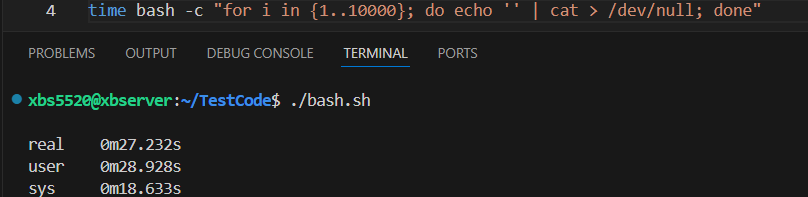
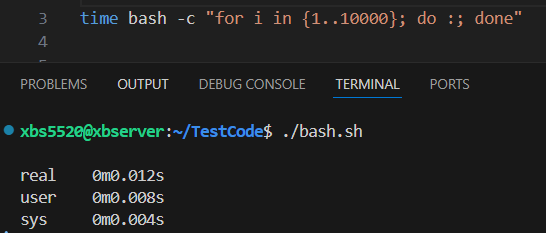
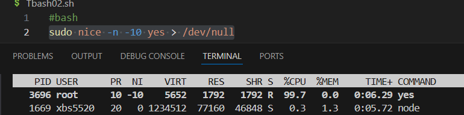

# context switch

A context switch is when the CPU stops running one process(or thread) and starts running another.

The "context" means all the information needed to resume execution later:

Program counter(where it left off in code)

CPU registers(temporary data in use)

Stack pointer(where local variables live)

Memory mapping(for process)

## why context switching happens?

Multitasking: The OS shares the CPU among processes.

Interrupts: A hardware device(keyboard, network card, timer) demands attention.

Blocking: A process waits for I/O, so the OS runs another.

Priority Scheduling: higher-priority task preempts a lower one.

## context switch cost

Saving state of the old process.

Loading state of the new one.

Potentially flushing caches/TLB(translation lookaside buffer).

context switch time (echo space and throws away the output  switch echo - cat)

no context switch time

**Threads** have cheaper context switches than processes (they share memory).

**Processes** require switching memory mappings, which is heavier.

In **real-time systems**, minimizing context switches is crucial for predictability.

# Process Scheduling

Policy + mechanism by which the OS decides:

which process/thread gets the CPU next?

For how long?

Since a CPU can only run one instruction stream at a time (per core), scheduling is how the OS gives the illusion of **multitasking**.

## Basic Types of Scheduling

**Non-preemptive**: Once a process starts, it runs until it blocks or finishes. Simple, but unfair.

**preemptive**: The OS can interrupt a running process and switch to another (most modern systems).

## Common Scheduling Algorithms

1. **First-Come,First-Served(FCFS) / FIFO**

processes run in the order they arrive

simple but long jobs can starve short ones("convoy effect")

2. **Shortest Job First(SJF)**

Always run the process with the shortest burst time.

Optimal (best) average waiting time, but needs knowledge of the future(hard in reality).

3. **Round Robin**

Each process gets a small time slice(quantum), then rotates.

Fair, no starvation, good for interactive systems.

4. **Priority Scheduling**

Each process has a priority. Higher priority gets CPU first.

Can cause starvation of low-priority processed unless you add aging(gradually increasing their priority)

5. **Real-Time Scheduling**

Linux supports three main policies:

SCHED_OTHER -- default CFS (Completely Fair Scheduler).

SCHED_FIFO -- real-time FIFO, highest priority runs first.

SCHED_RR -- real-time Round Robin, cycles high-priority tasks in time slices.

**In Embedded System**

FIFO/RR are used in embedded RTOS because they guarantee predictable, low-latency response, while CFS prioritizes fairness but sacrifices determinism.

## Linux Scheduling

Modern Linux uses the **Completely Fair Scheduler(CFS)**

Instead of fixed time slices, it tries to give each process a **fair share of CPU time** based on weight/priority.

Maintains a "virtual runtime" to keep track of how much CPU time each process has received.

Using nice command to set (NI)priority.  Range(-20 ~ 19)

PR = 20 + NI

**Lower PR/NI get higher priority**

Scheduling is a **trade-off** between fairness, responsiveness, and throughput.

In real-time or embedded systems, scheduling is more about **predictability** than fairness.

In general-purpose OS like Linux/Windows, scheduling is tuned for **responsiveness + fairness**.