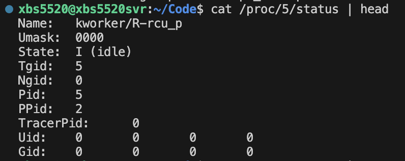
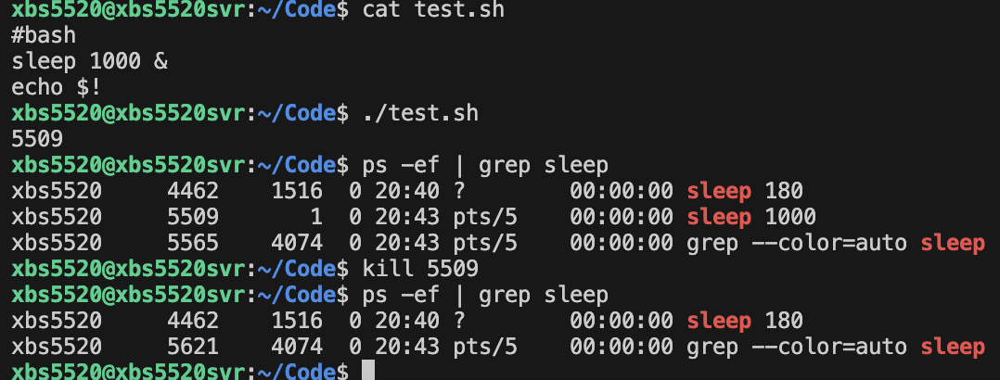

# Processes Introduction

## What different between program and process?

1. A Program is a static set of instructions and data. -- which is stored in the hardware.
2. A Process is a program in execution, with its own memory space, registers, and state.

## Why OS matters?

1. Abstraction: hides hardware complexity.
2. Resource management: dicides who gets CPU, memory, I/O.
3. Protection: prevents one program from crashing or corrupting others.


List Processes


PID : process ID
PPID : parent process ID
CMD : The command that started the process



Name : process name
State : Running(R), Sleeping(S), Zombie(Z), Idel(I),etc.


kill <PID> 


# fork() && process hierarchy

fork(): creates a new process(child) this is almost an exact copy of the parent.
After fork(), 2 process exist:
Parent : continues running the orginal code
Child  : starts executing right after the fork.

Parent and child have separate memory spaces. Changes in one do NOT affect the other.
Child inherits:
File descriptors(FD)  --  handle to an open file, socket, pipe, etc
Environment variables
PC(Program Counter) at the point of fork

Process IDs
getpid() -> returns current process ID
getppid() -> returns parent process ID


the child PID is returned to parent, but 0 is returned to the child.

what if child process sleep() 5s?
That means parent process terminates first! so the child process become an orphan process. 
In unix if a process is an orphan process then getppid() returns 1

But if parent process use wait(Null) it will not terminate before child process do. so you can get ppid.

what if change a var in child? is this var in parent process change too?
No! after change the child var , this var will allocate a new physical memory address. 
Although it has a same virtual address(which you can print).


In embedded system why might you avoid fork()?
Embedded system have very limited RAM, so duplicating processes can be wasteful. 

Threads share memory within the same process, making them much lighter.
Threads are faster to create and switch because they share the process's resources.
Some embedded OSes don't support fork at all
Fork can introduce unpredictable delays and overhead.

threads or direct execution are lighter, faster, and more predictable, which aligns the constrains and goals of embedded programming


# Thread

Thread is the smallest schedulable unit.
On Linux, each user thread maps to a kernel thread.

Shared among threads(in the same process):
Code(text) segment
Gloabl & static variables
Heap
File descriptors
Process address space

Private to each thread:
Registers/execution context
Stack
Thread-local storage (TLS)
Scheduling state

Context Switch: lighter than process switch(no separate page tables), but not free(cache/TLB fulsh, kernel overhead)

Race conditions: multiple threads reading/writing the same memory without synchronization -> unpredictable results.
Rule1: volatile ≠ thread safety
Rule2: printf ≠ synchronization

if you create a thread the pid is same but TID is not.


if you change a Global var in 2 thread, due to race conditions, you will not get Expected value.


but if you use mutexlock you will get Expected value.


# Process and Thread

## Process

Independent execution unit with its own memory space(code, data, stack, heap).

OS allocates resources separately.

Communication between processes requires IPC -- (Inter-Process Communication : pipes, sockets, shared memory etc.).


## Thread

Lightweight execution unit inside a process.

Threads share the process's memory(code, data, heap) but have separate stacks.

Communication between thread is easier(shared variables), but needs synchronization to avoid race conditions.


## Key Differences

Memory isolation -- processes are isolated threads are not.

Context switch overhead -- process context switch is heavier.

Failure impact -- a crash in one process usually doesn't kill others, but a bug in one thread can crash the whole process.


Process case : parent's global_var not affected by child (copy-on-write memory)

Thread case: global_var is shared and modified across threads.


## How processed communicate?

### Pipes(|)  -- small/streaming data

Anonymous pipes: parent - child communication, unidirectional 

Named pipes(FIFOs) : Exist in the filesystem, allow unrelated processes to communicate.

### Shared Memory -- large data

Fastest method: multiple processes map the same memory region.

Needs synchronization (mutexes/semaphores) to avoid race conditions.

### Message Queues

Kernel-managed queue where processes send/receive structured messages.

Useful for passing small chunks of data with defined order.

### Sockets -- Best for cross-machine or Remote

**UNIX domain sockets** (local machine).

**TCP/UDP sockets** (over network).

Flexible, supports communication between unrelated processes or even across machines.

### Signals

Lightweight notifications (e.g., `kill -SIGUSR1 pid`).

Can interrupt a process to tell it “something happened”.

### Semaphores / Mutexes / Condition Variables

Not for data transfer, but for **synchronization** between processes (often combined with shared memory).


# context switch

A context switch is when the CPU stops running one process(or thread) and starts running another.

The "context" means all the information needed to resume execution later:

Program counter(where it left off in code)

CPU registers(temporary data in use)

Stack pointer(where local variables live)

Memory mapping(for process)

## why context switching happens?

Multitasking: The OS shares the CPU among processes.

Interrupts: A hardware device(keyboard, network card, timer) demands attention.

Blocking: A process waits for I/O, so the OS runs another.

Priority Scheduling: higher-priority task preempts a lower one.


## context switch cost

Saving state of the old process.

Loading state of the new one.

Potentially flushing caches/TLB(translation lookaside buffer).


context switch time (echo space and throws away the output  switch echo - cat)


no context switch time


**Threads** have cheaper context switches than processes (they share memory).

**Processes** require switching memory mappings, which is heavier.

In **real-time systems**, minimizing context switches is crucial for predictability.


# Process Scheduling

Policy + mechanism by which the OS decides:

which process/thread gets the CPU next?

For how long?

Since a CPU can only run one instruction stream at a time (per core), scheduling is how the OS gives the illusion of **multitasking**.

## Basic Types of Scheduling

**Non-preemptive**: Once a process starts, it runs until it blocks or finishes. Simple, but unfair.

**preemptive**: The OS can interrupt a running process and switch to another (most modern systems).

## Common Scheduling Algorithms

1. **First-Come,First-Served(FCFS) / FIFO**

processes run in the order they arrive

simple but long jobs can starve short ones("convoy effect")

2. **Shortest Job First(SJF)**

Always run the process with the shortest burst time.

Optimal (best) average waiting time, but needs knowledge of the future(hard in reality).

3. **Round Robin**

Each process gets a small time slice(quantum), then rotates.

Fair, no starvation, good for interactive systems.

4. **Priority Scheduling**

Each process has a priority. Higher priority gets CPU first.

Can cause starvation of low-priority processed unless you add aging(gradually increasing their priority)

5. **Real-Time Scheduling**

Linux supports three main policies:

SCHED_OTHER -- default CFS (Completely Fair Scheduler).

SCHED_FIFO -- real-time FIFO, highest priority runs first.

SCHED_RR -- real-time Round Robin, cycles high-priority tasks in time slices.

**In Embedded System**

FIFO/RR are used in embedded RTOS because they guarantee predictable, low-latency response, while CFS prioritizes fairness but sacrifices determinism.

## Linux Scheduling

Modern Linux uses the **Completely Fair Scheduler(CFS)**

Instead of fixed time slices, it tries to give each process a **fair share of CPU time** based on weight/priority.

Maintains a "virtual runtime" to keep track of how much CPU time each process has received.


Using nice command to set (NI)priority.  Range(-20 ~ 19)

PR = 20 + NI

**Lower PR/NI get higher priority**


Scheduling is a **trade-off** between fairness, responsiveness, and throughput.

In real-time or embedded systems, scheduling is more about **predictability** than fairness.

In general-purpose OS like Linux/Windows, scheduling is tuned for **responsiveness + fairness**.


# Synchronization

## Race condition

Multiple threads/processes access shared data -> result depends on timing. -> need synchronization to make behavior deterministic.

## Mutex(Mutual Exclusion Lock)

Mutex = strict lock/unlock → protects integrity.

A binary lock.

At most one thread can hold it at a time.

Typical use: protect a critical section.

if one thread holds the mutex, others block until it's released.

## Semaphore

Semaphore = general resource control.

A counter + wait mechanism

Two types:

Binary semaphore(like a mutex but not strictly owned by a thread).

Counting semaphore(allows N threads into a critical section).

Typical use: limit access to a resource pool.


Max use is 2 so the third one can get resource until someone release it.

## Condition Variable

Condition variable = efficient “wait until event happens”.

Lets threads wait for a condition to become true

Always used with a mutex 

Example: A producer thread signals when data is available, a consumer waits until that signal.

# Deadlock

A deadlock happens when a group of processed or threads are stuck, each waiting for resources held by the others, and none can proceed.

## Conditions for Deadlock

Deadlock can only occur if **all four** are true:

1. **Mutual exclusion** – resources can’t be shared (e.g., mutex).
2. **Hold and wait** – a process holds one resource while waiting for another.
3. **No preemption** – resources can’t be forcibly taken away.
4. **Circular wait** – a cycle exists where each process waits for a resource held by the next.

```c
// example
void* thread1(void* arg) {
    pthread_mutex_lock(&lock1);
    printf("Thread 1 got lock1\n");
    sleep(1); // Force overlap
    pthread_mutex_lock(&lock2);
    printf("Thread 1 got lock2\n");

    pthread_mutex_unlock(&lock2);
    pthread_mutex_unlock(&lock1);
    return NULL;
}
void* thread2(void* arg) {
    pthread_mutex_lock(&lock2);
    printf("Thread 2 got lock2\n");
    sleep(1); // Force overlap
    pthread_mutex_lock(&lock1);
    printf("Thread 2 got lock1\n");

    pthread_mutex_unlock(&lock1);
    pthread_mutex_unlock(&lock2);
    return NULL;
}
```

## Strategies to Handle Deadlocks

**Prevention** → Break one of the 4 conditions.

- E.g. , always acquire locks in the same global order → avoids circular wait.

**Avoidance** → Banker’s algorithm (decide safe/unsafe state before allocating).

- Banker’s algorithm
  - **Banker’s Algorithm** is like a cautious banker deciding whether to give out loans. It’s a **deadlock avoidance** algorithm.
  - Steps
    - Process requests some resources.
    - Temporarily assume request is granted.
    - Run a **safety check**:
    - Can all processes eventually finish if they get what they still need?
    - If yes → safe state.
    - If not → unsafe (possible deadlock).
    - Only grant requests that keep the system in a **safe state**.

**Detection & Recovery** → Allow deadlock, then detect cycle in wait graph and kill/restart one process.

Deadlock is not about a single lock, but **interaction between multiple locks/resources**.

Embedded/real-time systems often prefer **prevention** (strict lock ordering, priority rules), because detection is too expensive.


# Virtual Memory Basics

Virtual memory is an abstraction that makes each process *think* it has a big, continuous block of memory — while in reality, memory is split into small chunks and shared among processes.

- **Page**: A fixed-size block of virtual memory (e.g., 4 KB).
- **Frame**: A fixed-size block of physical memory (RAM).
- The OS + MMU (Memory Management Unit) map **pages → frames**.

This mapping is stored in the **page table**.

## Key Terms

**TLB (Translation Lookaside Buffer)**:

- A tiny, super-fast cache inside the CPU.
- Stores recent page → frame translations.
- If the translation is not in TLB → *TLB miss* → must check page table in memory.

**Page Fault**:

- Happens when the requested page is not in RAM.
- OS must bring it from disk (slow).
- Could require swapping out another page (if RAM is full).

##  Why Virtual Memory?

- **Isolation**: Each process has its own space (can’t corrupt others).
- **Convenience**: Programs can use large addresses even if physical RAM is small.
- **Efficiency**: Multiple processes can share code/data (e.g., libc).

## Simple Example

Imagine:

- Virtual address space: 16 KB
- Page size: 4 KB
- Physical RAM: 8 KB

Then:

- 16 KB / 4 KB = 4 virtual pages (P0–P3).
- 8 KB / 4 KB = 2 physical frames (F0–F1).

If process wants P0 and P1 → they map to F0 and F1.
 If later it needs P2, but RAM is full → OS swaps something out → **page replacement**.

