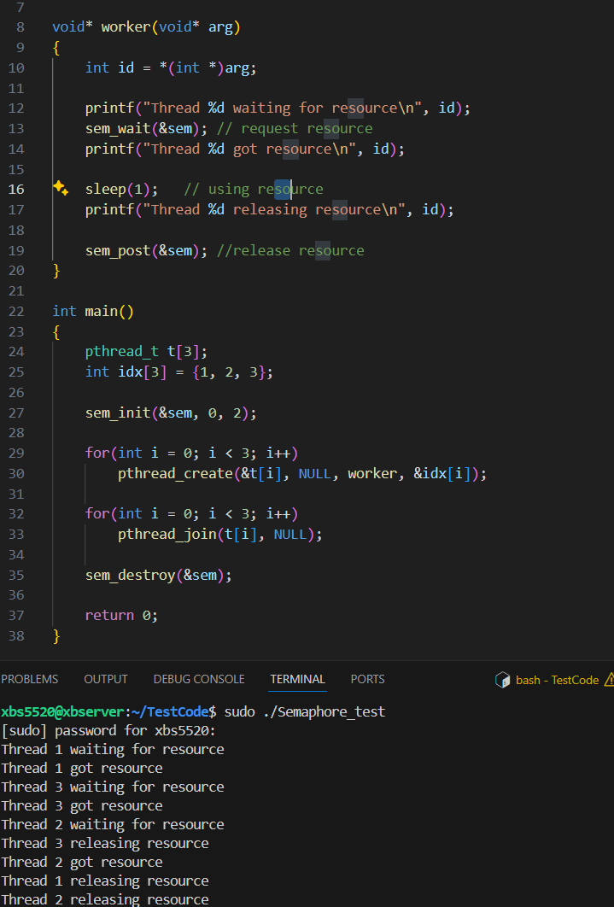

# Synchronization

## Race condition

Multiple threads/processes access shared data -> result depends on timing. -> need synchronization to make behavior deterministic.

## Mutex(Mutual Exclusion Lock)

Mutex = strict lock/unlock → protects integrity.

A binary lock.

At most one thread can hold it at a time.

Typical use: protect a critical section.

if one thread holds the mutex, others block until it's released.

## Semaphore

Semaphore = general resource control.

A counter + wait mechanism

Two types:

Binary semaphore(like a mutex but not strictly owned by a thread).

Counting semaphore(allows N threads into a critical section).

Typical use: limit access to a resource pool.



Max use is 2 so the third one can get resource until someone release it.

## Condition Variable

Condition variable = efficient “wait until event happens”.

Lets threads wait for a condition to become true

Always used with a mutex 

Example: A producer thread signals when data is available, a consumer waits until that signal.

# Deadlock

A deadlock happens when a group of processed or threads are stuck, each waiting for resources held by the others, and none can proceed.

## Conditions for Deadlock

Deadlock can only occur if **all four** are true:

1. **Mutual exclusion** – resources can’t be shared (e.g., mutex).
2. **Hold and wait** – a process holds one resource while waiting for another.
3. **No preemption** – resources can’t be forcibly taken away.
4. **Circular wait** – a cycle exists where each process waits for a resource held by the next.

```c
// example
void* thread1(void* arg) {
    pthread_mutex_lock(&lock1);
    printf("Thread 1 got lock1\n");
    sleep(1); // Force overlap
    pthread_mutex_lock(&lock2);
    printf("Thread 1 got lock2\n");

    pthread_mutex_unlock(&lock2);
    pthread_mutex_unlock(&lock1);
    return NULL;
}
void* thread2(void* arg) {
    pthread_mutex_lock(&lock2);
    printf("Thread 2 got lock2\n");
    sleep(1); // Force overlap
    pthread_mutex_lock(&lock1);
    printf("Thread 2 got lock1\n");

    pthread_mutex_unlock(&lock1);
    pthread_mutex_unlock(&lock2);
    return NULL;
}
```

## Strategies to Handle Deadlocks

**Prevention** → Break one of the 4 conditions.

- E.g. , always acquire locks in the same global order → avoids circular wait.

**Avoidance** → Banker’s algorithm (decide safe/unsafe state before allocating).

- Banker’s algorithm
  - **Banker’s Algorithm** is like a cautious banker deciding whether to give out loans. It’s a **deadlock avoidance** algorithm.
  - Steps
    - Process requests some resources.
    - Temporarily assume request is granted.
    - Run a **safety check**:
    - Can all processes eventually finish if they get what they still need?
    - If yes → safe state.
    - If not → unsafe (possible deadlock).
    - Only grant requests that keep the system in a **safe state**.

**Detection & Recovery** → Allow deadlock, then detect cycle in wait graph and kill/restart one process.

Deadlock is not about a single lock, but **interaction between multiple locks/resources**.

Embedded/real-time systems often prefer **prevention** (strict lock ordering, priority rules), because detection is too expensive.