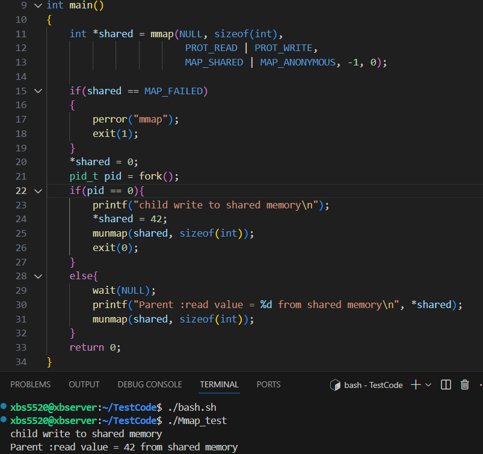
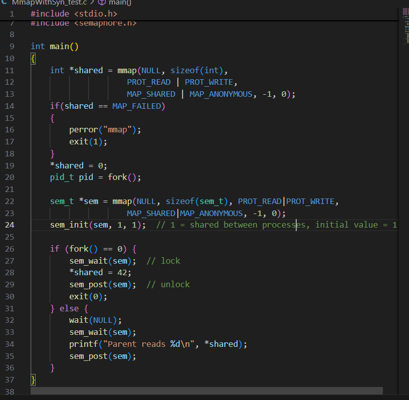

# Virtual Memory Basics

Virtual memory is an abstraction that makes each process *think* it has a big, continuous block of memory — while in reality, memory is split into small chunks and shared among processes.

- **Physical Memory** is divided into fixed-size **frames**.

- **Virtual Memory (process address space)** is divided into fixed-size **pages**.

- **Page**: A fixed-size block of virtual memory (e.g., 4 KB).
- **Frame**: A fixed-size block of physical memory (RAM).
- The OS + MMU (Memory Management Unit) map **pages → frames**

This mapping is stored in the **page table**.

## Key Terms

**TLB (Translation Lookaside Buffer)**:

- A tiny, super-fast cache inside the CPU.
- Stores recent page → frame translations.
- If the translation is not in TLB → *TLB miss* → must check page table in memory.

**Page Fault**:

- Happens when the requested page is not in RAM.
- OS must bring it from disk (slow).
- Could require swapping out another page (if RAM is full).

Because memory is limited, we need **page replacement algorithms** when no free frame exists.

##  Why Virtual Memory?

- **Isolation**: Each process has its own space (can’t corrupt others).
- **Convenience**: Programs can use large addresses even if physical RAM is small.
- **Efficiency**: Multiple processes can share code/data (e.g., libc).

## Simple Example

Imagine:

- Virtual address space: 16 KB
- Page size: 4 KB
- Physical RAM: 8 KB

Then:

- 16 KB / 4 KB = 4 virtual pages (P0–P3).
- 8 KB / 4 KB = 2 physical frames (F0–F1).

If process wants P0 and P1 → they map to F0 and F1.
 If later it needs P2, but RAM is full → OS swaps something out → **page replacement**.

# Page Replacement Algorithms

## FIFO(First-In, First-Out)

Replace the page that has been in memory the longest.

Simple: use a queue.

**Problem**: suffers from *Belady’s anomaly* (more frames ≠ always fewer faults).

**Belady’s anomaly**:

- A surprising phenomenon where **increasing the number of frames leads to \*more\* page faults**.
- LRU and optimal replacement algorithms do NOT suffer from this anomaly.

## LRU(Least Recently Used)

Replace the page that has not been used for the longest time.

Idea: past is a good predictor of future.

Implementation:

- Counter/stack to track last use.
- Hardware support (e.g., reference bits) makes it feasible.

**Better than FIFO**, but more expensive to implement.

In practice, **LRU has lower page fault rates** than FIFO.

### **Clock (a.k.a. Second-Chance)**

Approximation of LRU using a circular buffer ("clock hand").

Each page has a **reference bit (R)**:

- If R=1 → give a second chance (set R=0, skip).
- If R=0 → replace this page.

Efficient, low overhead, widely used in real OS.

| Algorithm | Advantage                              | Disadvantage                       |
| --------- | -------------------------------------- | ---------------------------------- |
| FIFO      | Simple, easy to implement              | Belady’s anomaly, poor performance |
| LRU       | Good performance (close to optimal)    | Expensive to implement exactly     |
| Clock     | Efficient, practical LRU approximation | Not perfectly LRU                  |

# Shared memory & `mmap`

Shared memory = fastest IPC (no kernel copying once mapped).

Used by databases, real-time systems, and producer–consumer patterns.

Key APIs: `shmget`, `shmat`, `shmdt`, `shmctl` (System V IPC), or `mmap` (POSIX).

Synchronization needed → typically **semaphores or mutexes**, since both processes can write.

## Why is shared memory faster than pipes or message queues?

**Shared Memory (`mmap`)**: Both processes map the *same physical memory page*. Once mapped, reads/writes are **direct memory access**— no copying, no syscalls after setup.

**Pipes/Message Queues**: Every write goes into kernel space → kernel copies data into a buffer → another process reads → kernel copies data back to user space. That’s **two copies** per message (user→kernel, kernel→user).

## What happens if both parent and child write at the same time?

get a **race condition**.  concurrent writes may **interleave unpredictably**

with Semaphore

