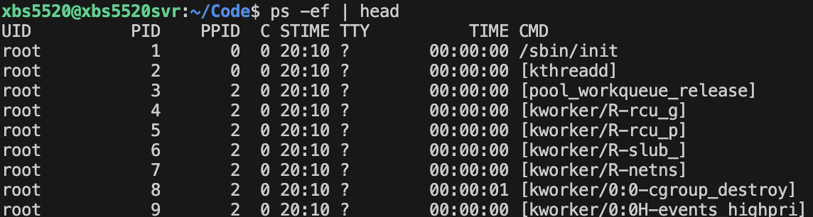
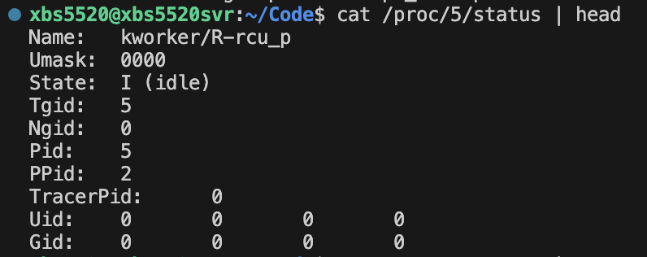
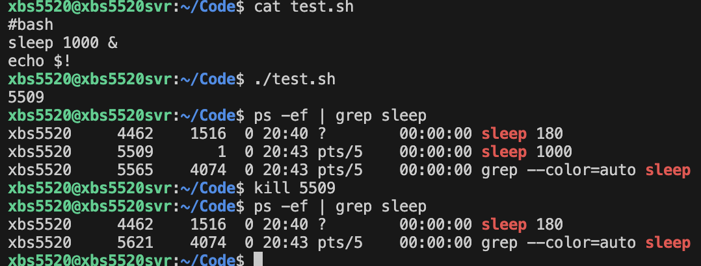
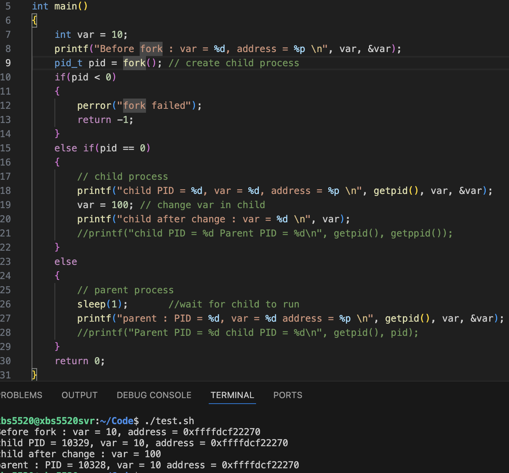
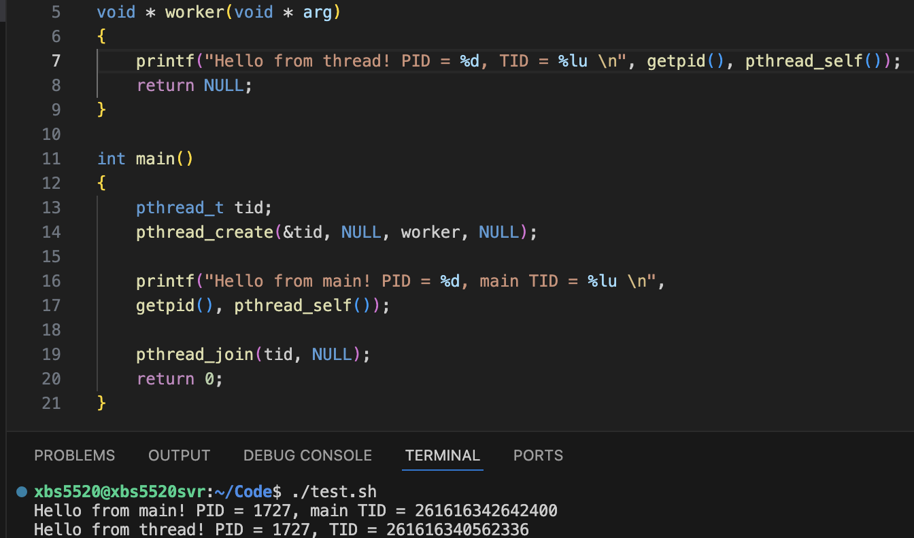
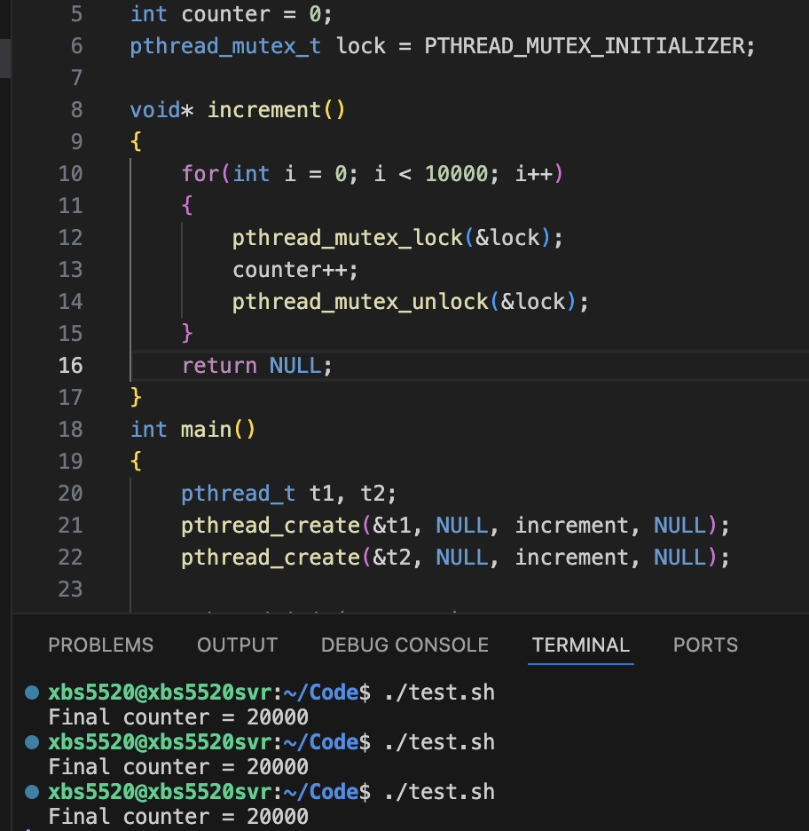
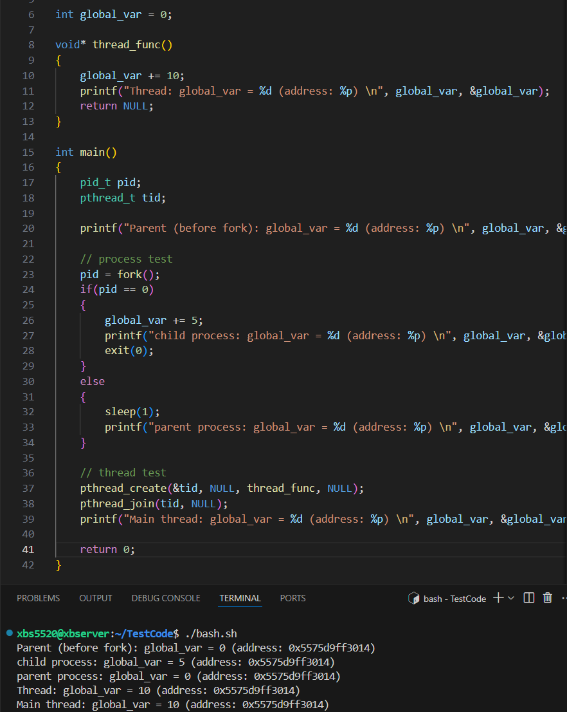

# Processes Introduction

## What different between program and process?

1. A Program is a static set of instructions and data. -- which is stored in the hardware.
2. A Process is a program in execution, with its own memory space, registers, and state.

## Why OS matters?

1. Abstraction: hides hardware complexity.
2. Resource management: decides who gets CPU, memory, I/O.
3. Protection: prevents one program from crashing or corrupting others.

List Processes

PID : process ID
PPID : parent process ID
CMD : The command that started the process

Name : process name
State : Running(R), Sleeping(S), Zombie(Z), Idel(I),etc.

kill <PID> 

# fork() && process hierarchy

fork(): creates a new process(child) this is almost an exact copy of the parent.
After fork(), 2 process exist:
Parent : continues running the orginal code
Child  : starts executing right after the fork.

Parent and child have separate memory spaces. Changes in one do NOT affect the other.
Child inherits:
File descriptors(FD)  --  handle to an open file, socket, pipe, etc
Environment variables
PC(Program Counter) at the point of fork

Process IDs
getpid() -> returns current process ID
getppid() -> returns parent process ID

the child PID is returned to parent, but 0 is returned to the child.

what if child process sleep() 5s?
That means parent process terminates first! so the child process become an orphan process. 
In unix if a process is an orphan process then getppid() returns 1

But if parent process use wait(Null) it will not terminate before child process do. so you can get ppid.

what if change a var in child? is this var in parent process change too?
No! after change the child var , this var will allocate a new physical memory address. 
Although it has a same virtual address(which you can print).

In embedded system why might you avoid fork()?
Embedded system have very limited RAM, so duplicating processes can be wasteful. 

Threads share memory within the same process, making them much lighter.
Threads are faster to create and switch because they share the process's resources.
Some embedded OSes don't support fork at all
Fork can introduce unpredictable delays and overhead.

threads or direct execution are lighter, faster, and more predictable, which aligns the constrains and goals of embedded programming

# Thread

Thread is the smallest schedulable unit.
On Linux, each user thread maps to a kernel thread.

**Shared among threads(in the same process)**:
Code(text) segment
Global & static variables
Heap
File descriptors
Process address space

**Private to each thread**:
Registers/execution context
Stack
Thread-local storage (TLS)
Scheduling state

**Context Switch:** lighter than process switch(no separate page tables), but not free(cache/TLB fulsh, kernel overhead)

**Race conditions:** multiple threads reading/writing the same memory without synchronization -> unpredictable results.
Rule1: volatile ≠ thread safety
Rule2: print ≠ synchronization

if you create a thread the pid is same but TID is not.

if you change a Global var in 2 thread, due to race conditions, you will not get Expected value.

but if you use mutexlock you will get Expected value.

# Process and Thread

## Process

Independent execution unit with its own memory space(code, data, stack, heap).

OS allocates resources separately.

Communication between processes requires IPC -- (Inter-Process Communication : pipes, sockets, shared memory etc.).

## Thread

Lightweight execution unit inside a process.

Threads share the process's memory(code, data, heap) but have separate stacks.

Communication between thread is easier(shared variables), but needs synchronization to avoid race conditions.

## Key Differences

Memory isolation -- processes are isolated threads are not.

Context switch overhead -- process context switch is heavier.

Failure impact -- a crash in one process usually doesn't kill others, but a bug in one thread can crash the whole process.

Process case : parent's global_var not affected by child (copy-on-write memory)

Thread case: global_var is shared and modified across threads.

## How processed communicate?

### Pipes(|)  -- small/streaming data

Anonymous pipes: parent - child communication, unidirectional 

Named pipes(FIFOs) : Exist in the filesystem, allow unrelated processes to communicate.

### Shared Memory -- large data

Fastest method: multiple processes map the same memory region.

Needs synchronization (mutexes/semaphores) to avoid race conditions.

### Message Queues

Kernel-managed queue where processes send/receive structured messages.

Useful for passing small chunks of data with defined order.

### Sockets -- Best for cross-machine or Remote

**UNIX domain sockets** (local machine).

**TCP/UDP sockets** (over network).

Flexible, supports communication between unrelated processes or even across machines.

### Signals

Lightweight notifications (e.g., `kill -SIGUSR1 pid`).

Can interrupt a process to tell it “something happened”.

### Semaphores / Mutexes / Condition Variables

Not for data transfer, but for **synchronization** between processes (often combined with shared memory).

